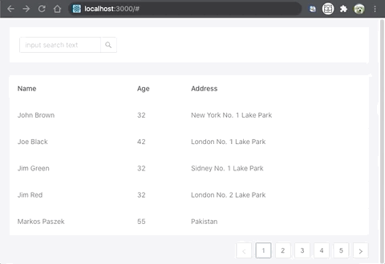

<div align="center">
  <h1>sync-query</h1>

  ❄️

  Use the React higher-order component to store the React State in URL query (routing parameters)
</div>

<hr />

[中文](./README-zh.md)

## Demo




^_^ This is demo of using sync-query in antd-design.

There is only three lines of code.

```js
// import
import { syncQueryHOC } from "sync-query";
// use syncQueryHOC
const MyComponentEnhance = syncQueryHOC(MyComponent, ['searchInput', 'pagination'], 'fetch');
<MyComponentEnhance></MyComponentEnhance>
//...
```

[More about the Demo](https://github.com/NeoYo/sync-query/tree/master/examples/antd/antd-demo)

Once we did this, there are powerful features below.

## Feature

- auto store react state in url query (URLSearchParam)
- auto call 'fetch' if react state is detected change.
- auto init react state from url query (URLSearchParam)
- zero dependency, only 2.8kb gzipped size.
- support TypeScript decorator

## Installation

`yarn add sync-query`

`npm i --save sync-query`

## Usage

### Use TypeScript Decorator

```typescript
import { SyncQueryFactory, syncQueryCb } from "sync-query";

@SyncQueryFactory(['searchInput', 'pagination']) // Listen to searchInput or Pagination changes when synchronized to URL Query
export class MyComponent extends Component {
    this.state = {
        searchInput: 'hello world',
        pagination: {
        },
    }
    @syncQueryCb(['searchInput']) // The fetch function is called to listen for a change in searchInput
    fetch() {
        // network fetch...
    }
}
```

### Use ES6 React HOC

``` js
import { syncQueryHOC } from "sync-query";

export class MyComponent extends Component {
    fetch() {
        // network fetch...
    }
}

export const MyComponentEnhance = 
    syncQueryHOC(
        MyComponent,
        ['searchInput', 'pagination'], // Listen to searchInput or Pagination changes when synchronized to URL Query
        'fetch',
        {
            callbackDeps: ['searchInput'], // The fetch function is called to listen for a change in searchInput
            wait: 600, // debounce，600ms
        }
    );
```

> Note: The SyncQueryFactory decorator factory and syncQueryHOC are placed closest to the MyComponent

## API

### syncQueryHOC

Receive a React component that returns a component with the ability to synchronize state to routing parameters

syncQueryHOC(WrappedComponent, stateList: string[], callbackName?:string, config?:SyncQueryConfig): EnhanceComponent

- WrappedComponent: The original component is decorated
- stateList: Pass an array, and the value of the state corresponding to the key will be listened to
- callbackName?: The effect method is triggered when changes are heard
- config?: SyncQueryConfig
    ```typescript
    type SyncQueryConfig = {
        wait: number,                           // The wait time for the debounce,， the unit is ms
        callbackDeps?: string[],                // CallbackDeps holds an array of state keys. When the value of the corresponding key in the state changes, the callback (network request, etc.) will be called.
                                                // When callbackDeps is not passed in, the default listener is equal to stateList
        parser?: IQueryParser,                  // Parser: Used to parse the routing parameter query to state. Default is JSON.parse
        stringify?: IQueryStringify,            // Generator: Used to generate the query string corresponding to state. Default is JSON.Stringify
    }
    ```

### SyncQueryFactory

SyncQueryFactory is a Decorator Factory, used in Typescript

SyncQueryFactory(stateList: string[], callbackName?:string, config?:SyncQueryConfig) 

> Note that a class decorator factory, SyncQueryFactory, and a method decorator, syncQueryCb, can be used together. SyncQueryHOC, a higher-order component, and the first two should be avoided as much as possible.

- stateList: Pass an array, and the value of the state corresponding to the key will be listened to
- callbackName?: The 'callbackName' method is triggered when a change is heard
- config?: SyncQueryConfig
    ```typescript
    type SyncQueryConfig = {
        wait: number,                           // The wait time for the debounce,， the unit is ms
        callbackDeps?: string[],                // CallbackDeps holds an array of state keys. When the value of the corresponding key in the state changes, the callback (network request, etc.) will be called.
                                                // When callbackDeps is not passed in, the default listener is equal to stateList
        parser?: IQueryParser,                  // Parser: Used to parse the routing parameter query to state. Default is JSON.parse
        stringify?: IQueryStringify,            // Generator: Used to generate the query string corresponding to state. Default is JSON.Stringify
    }
    ```

SyncQueryFactory Code is as follows:

```typescript
function SyncQueryFactory(stateList: string[], callbackName?:string, config?:SyncQueryConfig) {
    return function(WrappedComponent) {
        return syncQueryHOC(WrappedComponent, stateList, callbackName, config);
    }
}
```

### syncQueryCb

The syncQueryCb is a method decorator, used in conjunction with the SyncQueryFactory

syncQueryCb(callbackDeps?:string[])

- callbackDeps?: string[]  CallbackDeps holds an array of state keys. When the value of the corresponding key in the state changes, the callback (network request, etc.) will be called.

Examples： 

```typescript
import { SyncQueryFactory, syncQueryCb } from "sync-query";

@SyncQueryFactory(['searchInput', 'pagination']) // Listen to searchInput or Pagination changes when synchronized to URL Query
export class MyComponent extends Component {

    @syncQueryCb(['searchInput']) // The fetch function is called to listen for a change in searchInput
    fetch() {
        // network fetch...
    }
}
```

## License

MIT
